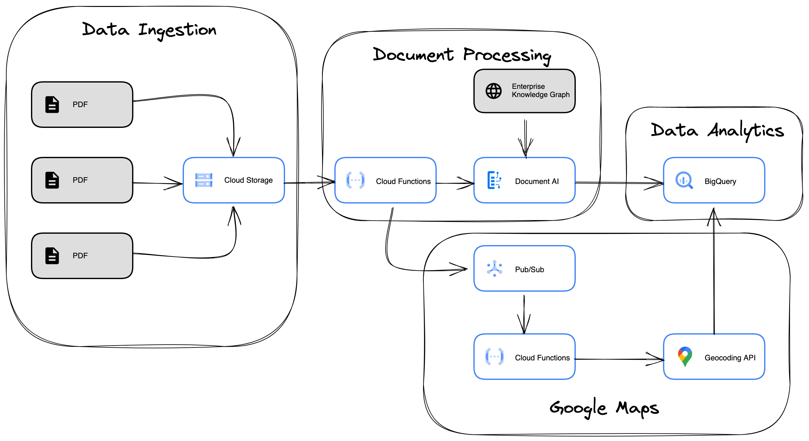

# Document AI Fraud Detection Demo with Enterprise Knowledge Graph

## Objective

Learn how to use Google Cloud Platform to *process and enrich* invoices so that we can **enable fraud detection**.

## Architecture



### Google Cloud Products Used

* [Google Cloud Document AI](https://cloud.google.com/document-ai)
* [Procurement DocAI](https://cloud.google.com/solutions/procurement-doc-ai)
  * [Invoice Parser](https://cloud.google.com/document-ai/docs/processors-list#processor_invoice-processor)
  * [Enterprise Knowledge Graph](https://cloud.google.com/document-ai/docs/ekg-enrichment)
* [Google Cloud Storage](https://cloud.google.com/storage)
* [Google Cloud Pub/Sub](https://cloud.google.com/pubsub/docs/overview)
* [Google Cloud Functions](https://cloud.google.com/functions)
* [Cloud Build](https://cloud.google.com/build)
* [Geocoding API](https://developers.google.com/maps/documentation/geocoding/start)
* [BigQuery](https://cloud.google.com/bigquery)

## Steps to re-create this demo in your own GCP environment

1. Create a Google Cloud Platform Project

1. [Install and setup the `gcloud` SDK & CLI](https://cloud.google.com/sdk/docs/install-sdk)

1. Enable the APIs in the project you created in step #1 above
   * Cloud Document AI API
   * Cloud Functions API
   * Geocoding API
   * Cloud Build API

```sh
# Replace with Your Project ID
gcloud config set project YOUR_PROJECT_ID

gcloud services enable documentai.googleapis.com

gcloud services enable cloudfunctions.googleapis.com

gcloud services enable geocoding-backend.googleapis.com

gcloud services enable cloudbuild.googleapis.com
```

1. Initialize Repository

    * Activate your Command Shell and clone this GitHub Repo in your Command shell using the command:
  
        ```sh
        git clone https://github.com/GoogleCloudPlatform/documentai-fraud-detection-demo.git
        ```

    * Change Directory to the Repo Folder

       ```sh
       cd documentai-fraud-detection-demo
       ```

2. Manage API Key

   * [Create an API Key](https://cloud.google.com/docs/authentication/api-keys#creating_an_api_key) - Note the **api key value**, you will need to plug this values in your cloud function's environment variables
  
   * Paste the API Key in the [`geocode-addresses/.env.yaml`](cloud-functions/geocode-addresses/.env.yaml) file.

   * [Add API restrictions](https://cloud.google.com/docs/authentication/api-keys#api_key_restrictions) - To set API restrictions:
        1. Select Restrict key in the API restrictions section.
        2. Select Geocoding API from the dropdown.
        3. Select the Save button.

3. Create your Doc AI processor
    * Go to Console > Doc AI > Create Processor > Invoice Parser (Under Specilaized)
      * Name the processor `fraud-detection-invoice-parser` (or something else you'll remember)
      * Note the **Region** and **ID** of the processor, you will need to plug these values in your cloud function's environment variables
    * Paste the processor location and ID in the [`process-invoices/.env.yaml`](cloud-functions/process-invoices/.env.yaml) file

4. Execute Bash shell scripts in your Cloud Shell terminal to create cloud resources (i.e Google Cloud Storage Buckets, Pub/Sub topics, Cloud Functions, BigQuery tables)

     1. Update the value of PROJECT_ID in [`.env.local`](.env.local) to match your current projectID

     2. Execute your .sh files to create cloud resources

        ```sh
        bash create-archive-bucket.sh
        bash create-input-bucket.sh
        bash create-output-bucket.sh
        bash create-pub-sub-topic.sh
        bash create-bq-tables.sh
        bash deploy-cloud-function-process-invoices.sh
        bash deploy-cloud-function-geocode-addresses.sh
        ```

5. Testing/Validating the demo
     * Upload a sample invoice in the input bucket
     * At the end of the processing, you should expect your BigQuery tables to be populated with extracted entities as well as enriched data (i.e placesID, lat, long, formatted address, name, url, description)
     * Reading the results, we can now build custom business intelligence rules using these enriched fields to enable fraud detection. For example, if the address is not something the Geocoding API can find, then it is an indicator of either incorrect value or fraudulent invoice
