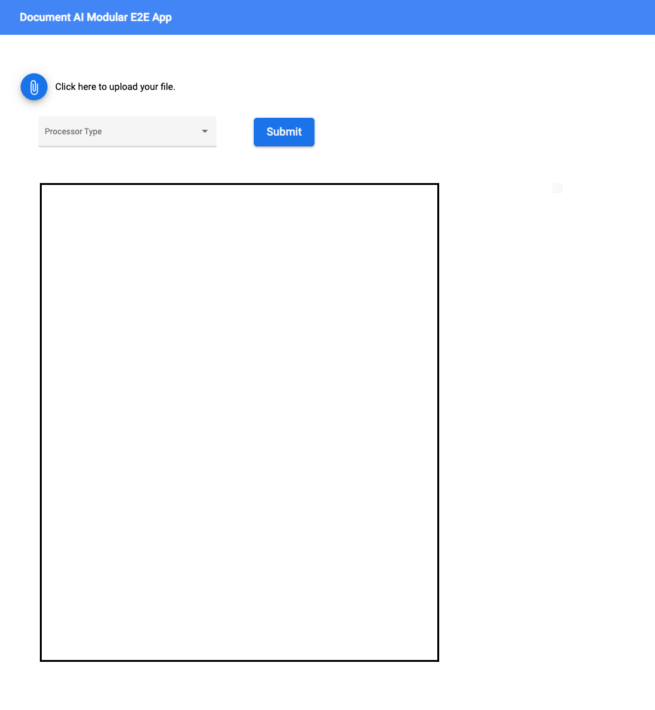

# Document AI Modular Application

This Document AI application is an end to end application that shows how to integrate Document AI into full-stack application.
This is the starting point and uses modular architecture so developers could easily demo Document AI and add components that fit their needs to quickly create a tailored demo.

This application uses a Flask backend server to handle Document AI API calls and a Angular Frontend.

## Quickstart 

Before clicking make sure Document AI API is enabled and your project has at least one processor created. 

This applicaition currenlty support OCR, Invoice and Form processors.  

[](https://deploy.cloud.run)

## Prerequisites

Before you can run the application you first need to make sure you have the [Google CLI](https://cloud.google.com/sdk/docs/install) installed.

once you have the CLI installed run

```bash
 gcloud init
```

This will create a empty project with billing not setup. To use the APIs this application needs you will need to [setup your billing information](https://cloud.google.com/billing/docs/how-to/manage-billing-account?hl=en_GB)

Once billing is enabled and setup you can then enable the Document AI API by running

```bash
gcloud services enable documentai.googleapis.com
```

You will need to create processors inorder to use this application, currently this application supports OCR, Form and Invoice processors.[Follow these instructions](https://cloud.google.com/document-ai/docs/create-processor) to create the processors you need.

Now you can setup the application default authentication by running

```bash
gcloud auth application-default login
```

## Running Application

Now that you have your project setup and you're logged into your Google Cloud project we can run the application. To run the application you will need to first start the Backend server and then the Frontend server. Follow the steps below.

### Running Backend Server

Make sure you're in the Backend directory

```bash
cd Backend
```
When you're in the Backend server directory you'll need to install all the dependencies in a [virtualenv][virtualenv] using pip.

[virtualenv][virtualenv] is a tool to create isolated Python environments.

With [virtualenv][virtualenv], it's possible to install this library without needing system
install permissions, and without clashing with the installed system
dependencies.

[virtualenv]: <https://virtualenv.pypa.io/en/latest/>


**Mac/Linux**

```bash
    pip install virtualenv
    virtualenv <your-env>
    pip install -r requirements.txt
```

**Windows**

```bash
    pip install virtualenv
    virtualenv <your-env>
    <your-env>\Scripts\pip.exe install -r requirements.txt
```

Once the dependencies are installed you can then run the Backend server.

Before running the server make sure the location variable is changed to the location of your project (us or eu) and then run

```bash
python -m flask run
```

Now that you have the Backend server running you can now start the Frontend server.

### Running Frontend Server

Make sure you're in the Frontend directory and you've opened a new terminal since we want both servers to run at the same time.

```bash
cd Frontend
```

When you're in the Frontend server directory you'll need to install all the dependencies

```bash
npm install
```

Once the dependencies are installed you can then run the Frontend server.

To start a local development server run

```bash
ng serve
```

The app will automatically reload if you change any of the source files in the Frontend directory.

Navigate to [http://localhost:4200/](http://localhost:4200/) and now you should now be able to see the application.



#### Building the project
Run ng build to build the project. The build artifacts will be stored in the dist/ directory.

## Components

The following is a list of existing components and their functionality

* Base Layer - Base Layer holds all imported components
* Canvas - This component handles document display and annotation
* Entity Tab - This component extracts text from the Document Proto and displays the text and highlights the bounding boxes depending on selection
* Processor Selection - This component retrieves available processors and displays them, allows for processor selection, validates inputs of processors and the uploaded PDF, and sends the uploaded PDF for document processing
* Upload File - This component handles document upload, updates the data service with the uploaded file, and validates that the uploaded file is a PDF and less them 20mb
* Data Sharing Service - This service handles the sharing of data between different components 
* Document Annotation Class - This class handles the bounding box drawing and highlight

## Contributing

* See [CONTRIBUTING.md](CONTRIBUTING.md)
